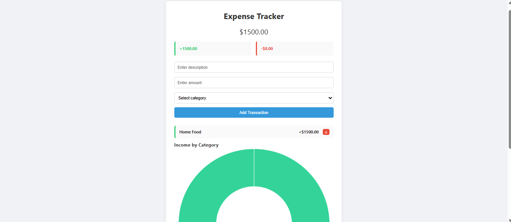

# 💸 Expense Tracker

A simple and elegant web-based expense tracker that helps you manage your income and expenses with real-time summaries and category-based visualization.

---

## Demo

  

---

## Features

- 📥 Add Transactions: Quickly add income or expenses with a description, amount, and category.
- 📊 Visualize Income by Category: Interactive chart powered by Chart.js showing income distribution.
- 💰 Real-Time Balance Summary: Automatically updates total balance, income, and expenses.
- 💾 Persistent Storage: Uses localStorage to save your data between sessions.
- 🧹 Delete Transactions: Remove individual transactions instantly with a modern styled delete button.
- 📱 Responsive Design: Optimized layout for desktop and mobile screens.


## How to Use

1. Enter a Description. Type what the transaction is for (e.g. "Salary", "Groceries", "Bus Ticket").
2. Enter an Amount.
- Use positive numbers for income (e.g. 1000)
- Use negative numbers for expenses (e.g. -25)
3. Select a Category. Choose the appropriate category from the dropdown (Food, Transport, etc.).
4. Click “Add Transaction”. Your entry will appear in the transaction history below, and the balance/summary/chart will update automatically.
5. Delete a Transaction. Click the 🗑️ button next to any transaction to remove it — the summary and chart will update accordingly


---

## Technologies Used

- HTML5
- CSS3 
- JavaScript (ES Modules)
- Chart.js for visualizations
- LocalStorage API for persistence

  
---

## Getting Started

### Prerequisites

- Modern web browser (Chrome, Firefox, Edge, Safari)
- Internet connection

### Setup

1. Clone the repository:

```bash
git clone https://github.com/your-username/expense_tracker.git
cd expense-tracker


